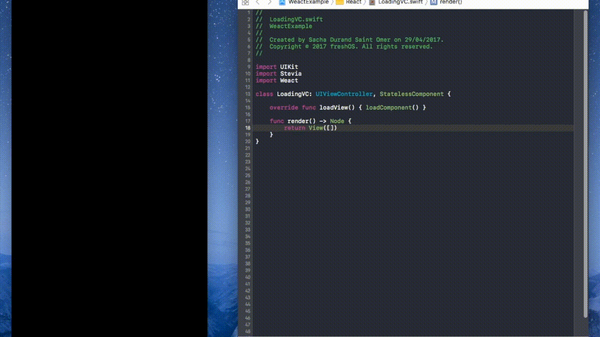

# Komponents
[](https://developer.apple.com/swift)

[](https://github.com/Carthage/Carthage)
[](https://cocoapods.org)
[](https://www.bitrise.io/app/a6b939ad01d973da)
[](https://github.com/freshOS/then/blob/master/LICENSE)


Komponents is a Swift framework for building component-oriented interfaces.  
Because it's unfair to need javascript to enjoy Components ! 😎

|      | Komponents                                   |
| ---- | ---------------------------------------- |
|  🔶  | Pure **Swift** (no JS, no XML)           |
|   🎨 | **Declarative Api** |
| 💉 | **Hot Reload** with [ injectionForXcode](http://johnholdsworth.com/injection.html)|
|  ⚙️ | Diff algorithm running **in background**           |
|  🏗    | Can be used **Incrementally** in your App |
|  🕸  | **No** external **Dependencies**           |



*<p align="center">Building a Loading screen with Hot reload 🎩</p>*


```swift
class LoadingVC: UIViewController, StatelessComponent {

    override func loadView() { loadComponent() }

    func render() -> Tree {
        return
            View([
                HorizontalStack(layout: .center, [
                    Label("Loading..."), ActivityIndicatorView(.gray)
                ])
            ])
    }
}
```
This is all we need to render a loading view !

## Getting Started

New to components? Fear not! [Facebook's React guide](https://facebook.github.io/react/) is a gold mine of information to get you started :)


The easiest way to get started and feel the power of Komponents is to take a look at the example project `KomponentsExample.xcodeproj` and play around !

For an even better experience, we strongly recommend enabling [Hot reload](https://github.com/freshOS/Komponents/wiki/Hot-Reload)


You can learn how, like React, Komponents tries to be smart about what it rerenders when the state changes in [Patching](https://github.com/freshOS/Komponents/wiki/Patching) section.

You can find more detailed information and guides in the [Wiki](https://github.com/freshOS/Komponents/wiki)

## Installation
Komponents can be installed Manually, via Carthage, Cocoapods or Swift Package Manager.  
Detailed installation steps in the wiki [here](https://github.com/freshOS/Komponents/wiki/Installation)

## Contributors
[YannickDot](https://github.com/YannickDot),
[S4cha](https://github.com/S4cha), YOU ?!  
We'd love to hear what you think so don't hesitate to reach out through an issue or via twitter
[@sachadso](https://twitter.com/sachadso)

## License
Komponents is released under the MIT license. See [LICENSE](https://github.com/freshOS/Komponents/blob/master/LICENSE)  for details.

## Inspiration
[Facebook's React](https://facebook.github.io/react/), [ComponentKit](https://github.com/facebook/componentkit),
[Preact](https://github.com/developit/preact), [Vue.js](https://vuejs.org) AlexDrone's render, Angular...

## Other great libraries
We're not the first to tackle the great endeavor of swift components and here are some other very cool projects :
 - [Alexdrone's render](https://github.com/alexdrone/Render)
 - [joshaber's Few.swift](https://github.com/joshaber/Few.swift/tree/master/FewDemo)
 - [BendingSpoons' katana](https://github.com/BendingSpoons/katana-swift)

# ⚠️  v 0.2 🏗
Please be aware that this is still very experimental 🔬.  
The actual api can and *will* change.  
This is not battle-tested and we advise you against using this in Appstore Apps (for now)


### Declarative Styling via Props 🎨

Applying styles directly on the UIKit elements was super handy in `v0.1` but came with major strings attached. Indeed, the styles blocks in the nodes **could only be called on the main thread**, because UIKit is meant to be accessed from the UI Thread (for the most part).
Also, in order to compare styles, we needed to create a duplicate UIKit element (heavy) and look for differences on it.

That's where `Props` come in!

The idea is to have a Props layer, aka **a structure that defines an element's style**, that is `Equatable`.
Being equatable, it becomes trivial to compare two buttons styles.
For instance, you can just write :  
 `let styleIsTheSame = (button.props == newButton.props)`

 Being Value-typed, it is also safe to process the diff in background !

Could we get all this goodness for free? Of course not, welcome to engineering.
The major drawback is that we have to bridge every UIKit element property to its corresponding `Props` struct.

However the properties supported can only get better with time classic escape hatch through refs will always be accessible to access UIkit elements if a property is not yet supported.

This is worth it!

### A dead-simple declarative layout 📐
The coming version is switching from Autolayout (and Stevia) to a declarative layout.  
The new layout system is based on a super simple `Layout` struct, that, combined with classic `StackViews` enables 99.9% of layout cases.
It is a value type, meaning it will be thread safe and thus enable comparison in a background thread :)

### Diffing on the virtual DOM. 🚀

With `elements`, `styling`, and `layout` purely **declarative**, **Value-Type** and **Equatable**, we can now safely put all the heavy duty stuff off to a background thread !!!

In `v0.2`, the [diffing](https://facebook.github.io/react/docs/reconciliation.html) algorithm  (also known as reconciliation) will run on the virtual DOM, on a background thread and only schedule  UI changes on the UI thread. 🎉
